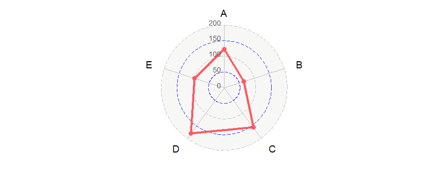
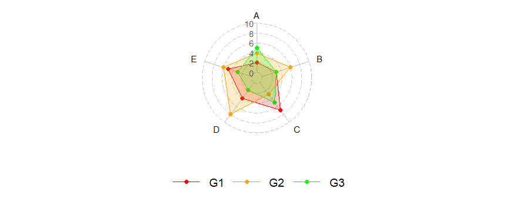

ggradar2
================

`ggradar2` allows you to build radar charts (aka spider charts) with ggplot2. 
This package is based on [Paul
Williamson’s](http://rstudio-pubs-static.s3.amazonaws.com/5795_e6e6411731bb4f1b9cc7eb49499c2082.html)
code, with new aesthetics and compatibility with ggplot2 2.0.

It was inspired by
[d3radaR](http://www.buildingwidgets.com/blog/2015/12/9/week-49-d3radarr),
an htmlwidget built by
[timelyportfolio](https://github.com/timelyportfolio).


## Notes

- The ownership of this "ggradar2" package belongs to [Ricardo Bion](https://github.com/ricardo-bion/ggradar), the creator of the "ggradar" package.
- The names of many other contributors are not listed one by one, such as [Pedro Sartori](https://github.com/pedrosdr/ggradar/tree/ggradar2).
- The original "ggradar" package could be found [here](https://github.com/ricardo-bion/ggradar).


## Install `ggradar2`

``` r
devtools::install_github("PhDMeiwp/ggradar2", dependencies = TRUE)
```

If the above method fail, please try downloading the .Zip or .tar.gz file of this R package to your local path of your computer,
and install it using the following method:

``` r
devtools::install_local("~/ggradar2-master.zip")  # zip file

devtools::install_local("~/ggradar2_0.3.tar.gz")    # tar.gz file

# Please replace the path and filename with the information of the local file you downloaded. 
```

## Use `ggradar2`


``` r
library(ggradar2) 
```

### Example 1 (one group):

``` r
df <- data.frame(
      NAME = 'G1',
      A = 0.4,
      B = 0.8,
      C = 0.5,
      D = 0.8,
      E = 0.5
      )
ggradar2(df)
```

<!-- -->

### Example 2 (grid line setting):

``` r
df <- data.frame(
        NAME = 'G1',
        A = 123,
        B = 65,
        C = 157,
        D = 181,
        E = 99
        )
ggradar2(df,
        # radar values
        values.radar = c("0", "50", "100", "150", "", "200"),
        # grid lines
        gridline.n2.colour = "blue",
        gridline.n4.colour = "blue",
        # grid labels
        gridline.label.offset.y = 0,
        # axis labels
        axis.label.offset = 1.2
        )
```

<!-- -->


### Example 3 (multiple groups):

``` r
df <- data.frame(
        NAME = c('G1', 'G2', 'G3'),
        A = c(0.2, 0.4, 0.5),
        B = c(0.3, 0.6, 0.3),
        C = c(0.7, 0.3, 0.5),
        D = c(0.4, 0.8, 0.2),
        E = c(0.5, 0.6, 0.3)
        )
ggradar2(df)
```

<!-- -->


### Example 4 (fill setting):

``` r
df <- data.frame(
        NAME = c('G1', 'G2', 'G3'),
        A = c(2, 4, 5),
        B = c(3, 6, 3),
        C = c(7, 3, 5),
        D = c(4, 8, 2),
        E = c(5, 6, 3)
        )
ggradar2(df,
        values.radar = c("0", "2", "4", "6", "8", "10"),
        grid.line.width = 0.3,
        # group parameters
        group.line.width = 0.5,
        group.point.size = 2,
        group.colours = c("red","orange","green"),
        fill = TRUE,
        fill.alpha = 0.5,
        axis.label.offset = 1.15,
        axis.label.size = 4,
        background.circle.colour = "white"
        )
```

<!-- -->


### Example 5 (default ggradar plot): 

``` r
df <- data.frame(
        NAME = 'G1',
        A = 0.4,
        B = 0.8,
        C = 0.5,
        D = 0.8,
        E = 0.5
       )
ggradar2(df,
        # radar values
        values.radar = c("0%", "50%", "", "", "", "100%"),
        # grid labels
        grid.label.color = "#000000",
        grid.label.size = 6,
        gridline.label.offset.x = -0.1,
        gridline.n2.colour = "#007A87",
        # group
        group.point.size = 6
        )
```

<!-- -->
